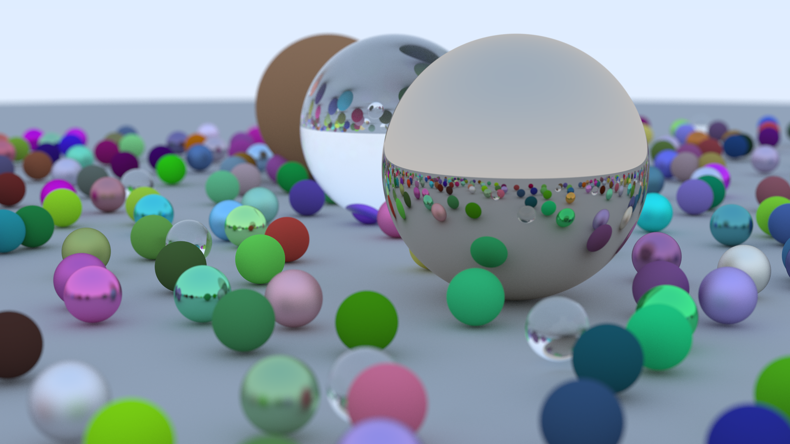

# Ray Tracing

This is a simple ray tracer implementation in C++ that renders a random scene with various materials and shapes. The output is saved as a PNG image file. The project follows the tutorial from [Ray Tracing in One Weekend](https://raytracing.github.io/books/RayTracingInOneWeekend.html) by Peter Shirley.



## Features

* Ray tracing for spheres in a 3D space.
* Materials: Lambertian, Metal, and Dielectric.
* Anti-aliasing with multiple samples per pixel.
* Depth of field with an adjustable aperture.
* Camera position and orientation.
* Progress bar during rendering.
* Export to PNG file format.

## Dependencies

* [libpng](http://www.libpng.org/pub/png/libpng.html) for PNG file handling.
* [CMake](https://cmake.org/) for building the project.

## Building the Project

1. Install the required dependencies on your system.
2. Clone this repository:

```bash
git clone https://github.com/voltjia/ray-tracing.git
```

3. Create a build directory and navigate to it:

```bash
mkdir build
cd build
```

4. Run CMake to generate the build files:

```bash
cmake -DCMAKE_BUILD_TYPE=Release ..
```

5. Build the project using the generated build files:

```bash
cmake --build .
```

## Optional Features

The project supports optional parallelization using OpenMP and/or MPI. To enable these features, use the following CMake options:

* For OpenMP: `-DUSE_OPENMP=ON`
* For MPI: `-DUSE_MPI=ON`

For example, to build the project with MPI support, run:

```bash
cmake -DUSE_MPI=ON -DCMAKE_BUILD_TYPE=Release ..
```

Then build the project as described earlier.

## Usage

```bash
./trace <output.png>
```

Replace `<output.png>` with the desired output file name.

## Example

```bash
./trace output.png
```

This will render a random scene and save the output as `output.png`.

## Customization

You can modify the following constants in the `main` function to customize the output:

* `aspect_ratio`: Controls the aspect ratio of the output image.
* `image_width`: Sets the width of the output image.
* `image_height`: Sets the height of the output image.
* `samples_per_pixel`: Defines the number of samples per pixel for anti-aliasing.
* `max_depth`: Sets the maximum recursion depth for reflections and refractions.
* Camera parameters, such as position, orientation, and aperture, can be adjusted in the `camera` object initialization.

## Acknowledgments

This project is based on the [Ray Tracing in One Weekend](https://raytracing.github.io/books/RayTracingInOneWeekend.html) by Peter Shirley.
